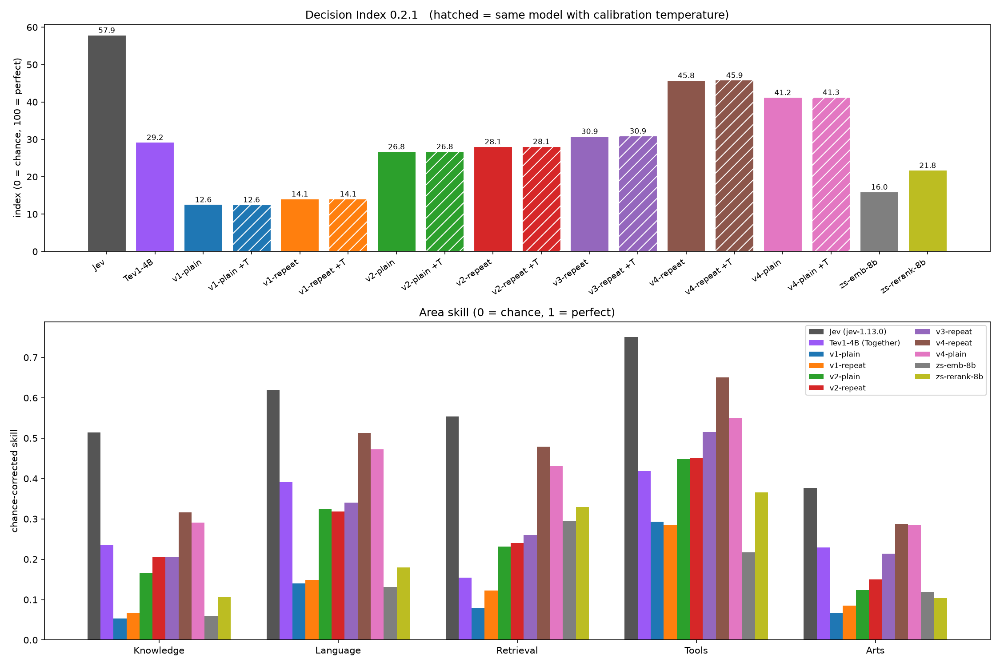
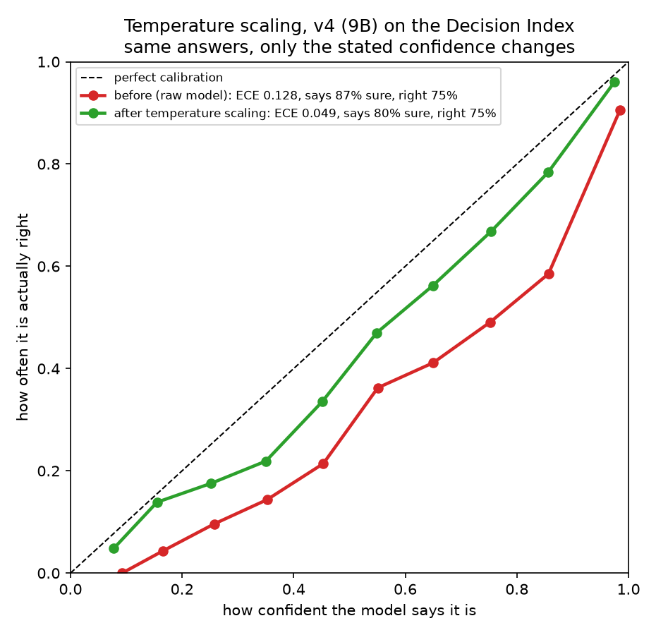
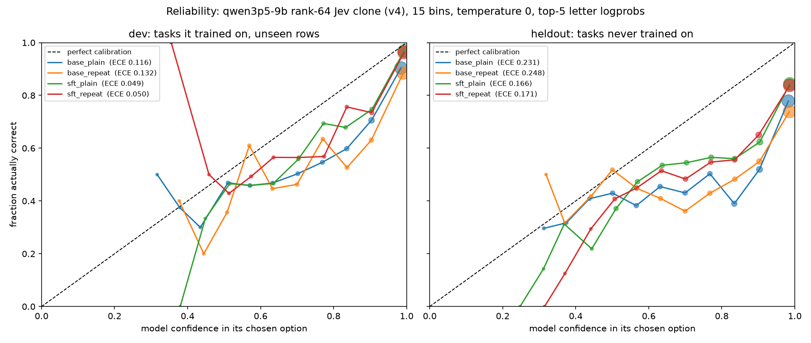
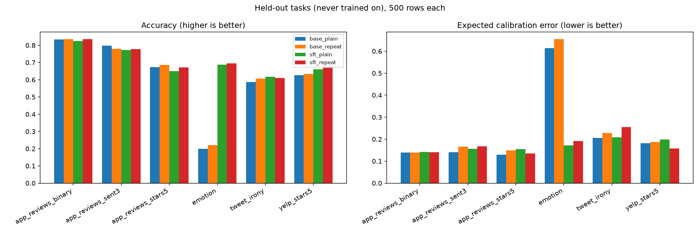
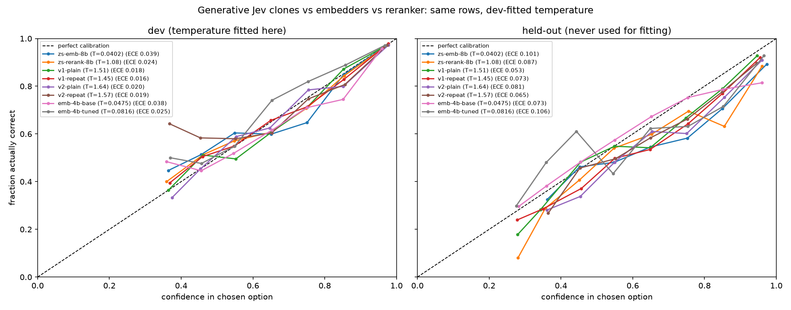

# Jev-style decision classifiers on Fireworks

Can we fine-tune small open models into Jev-style "decision engines" (read a JSON task with `state`,
`question` and lettered `options`, answer with one letter, and give honest probabilities), and how do
they compare with Together's Tev, Jev itself, and off-the-shelf embedders on the public
[Decision Index](https://huggingface.co/spaces/multimodalart/jev-decision-index)?

## Headline results (Decision Index 0.2.1, the board's default)


| model name                  | base model           | Decision Index score | why it matters                                                             |
| --------------------------- | -------------------- | -------------------- | -------------------------------------------------------------------------- |
| Jev (board)                 | unpublished          | 57.9                 | reference                                                                  |
| **ours v4, prompt twice**   | Qwen3.5 9B, LoRA r64 | **45.9**             | 2nd of all models at 10B or below; beats Tev on 29 of 33 shared benchmarks |
| ours v4, prompt once        | Qwen3.5 9B           | 41.3                 | prompt repetition adds ~4.6 points at 9B                                   |
| ours v3, prompt twice       | Qwen3 4B             | 31.0                 | beats Tev at the same size on an older base                                |
| Tev1-4B (board)             | Qwen3.5 4B           | 29.2                 |                                                                            |
| ours v2, prompt twice       | Qwen3 4B             | 28.1                 |                                                                            |
| untrained Qwen3 reranker 8B |                      | 21.8                 |                                                                            |
| untrained Qwen3 embedder 8B |                      | 16.0                 | best on our held-out tasks, weak on reasoning                              |


`+T` rows in the notebooks add a calibration temperature fit on our own dev rows. With it, v4's
calibration error on the board's method is 0.075 (Jev 0.074, Tev 0.104).

Not a certified board entry: we rebuilt the suite ourselves (same question ids, not byte-identical),
the top-5 logprob limit slightly understates ToolRet/BRIGHT, and we declare train-split overlap on
BANKING77 and CLINC150. Trained-on test items count as wrong.



*Top: overall index (hatched = same model with the calibration temperature, which barely moves the
index because most benchmarks score only the chosen option). Bottom: skill per area. v4 beats Tev in
every area and is closest to Jev on Tools and Language; the untrained embedder and reranker only do
well on Retrieval.*

## Versions

All versions use Fireworks managed SFT (LoRA) and the same prompt: a system instruction plus a JSON
`{state, question, options}` with lettered options; the answer is one letter, thinking off.


| model version | base model   | LoRA rank | training data                                                                                                                                                                                                                                             | prompt styles | what changed                                                                           |
| ------------- | ------------ | --------- | --------------------------------------------------------------------------------------------------------------------------------------------------------------------------------------------------------------------------------------------------------- | ------------- | -------------------------------------------------------------------------------------- |
| v1            | `qwen3-0p6b` | 16        | 39k rows: 26 public tasks (NLI, BoolQ, intent, topic, sentiment, moderation, paraphrase/QA) + 4 rule-generated policy tasks; at most 5 options per question                                                                                               | once, twice   | baseline; 6 tasks held out entirely (app_reviews x3, Yelp stars, emotion, tweet irony) |
| v2            | `qwen3-4b`   | 64        | same as v1                                                                                                                                                                                                                                                | once, twice   | bigger base model and rank                                                             |
| v3            | `qwen3-4b`   | 64        | v2 + ~12.7k rows from 13 external look-alikes of the Decision Index benchmarks where Tev beat us (WANLI, SNLI, SciTail, long-document NLI, SocialIQA, PIQA, COPA, HaluEval, financial sentiment, sarcastic headlines, limerick pairs, yes/no rephrasings) | twice         | targeted data + contamination filter                                                   |
| v4            | `qwen3p5-9b` | 64        | same as v3                                                                                                                                                                                                                                                | once, twice   | Qwen3.5 base (Tev's model family), 9B                                                  |


Why v1 to v3 use Qwen3 while Tev uses Qwen3.5 4B: Fireworks does not offer Qwen3.5 4B for fine-tuning
(`qwen3p5-4b` is in the registry but not LoRA-tunable). The smallest tunable Qwen3.5 is 9B, which is
what v4 uses. So v3 vs Tev is a same-size comparison on an older base model, and v4 vs Tev is the
same model family at about twice the size.

## Key tricks

**Temperature scaling.** The models state more confidence than they earn. We divide every option's
log-probability by one number T (about 1.4 to 1.9) before renormalizing. That softens every answer
alike, never changes which option wins, so accuracy is untouched. T is fit only on our own dev rows,
then checked on tasks it never saw: held-out calibration error roughly halves for every version, and
v4's Decision Index calibration error falls from 0.176 to 0.075 (Jev 0.074).



*Same v4 answers before and after temperature scaling. Raw, it says it is 87% sure on average but is
right 75% of the time; after scaling it says 80%. Every confidence bin moves toward the diagonal.*



*v4 on our own eval. Fine-tuning makes confidence honest on trained tasks (left) but it stays
overconfident on tasks it never saw (right), which is what the temperature corrects.*

**Prompt repetition** ([Leviathan et al., 2025](https://arxiv.org/pdf/2512.14982)). Send the task
twice so every token can attend to the whole prompt, at no extra output cost:

```text
{task JSON}

Let me repeat that:

{task JSON}
```

We train and evaluate with the same format. On the Decision Index (0.2.1), prompt twice beat prompt
once in every version we trained both ways:


| model version | prompt once | prompt twice | gain from repetition |
| ------------- | ----------- | ------------ | -------------------- |
| v1 (0.6B)     | 12.6        | 14.1         | +1.5                 |
| v2 (4B)       | 26.8        | 28.1         | +1.3                 |
| v4 (9B)       | 41.3        | 45.8         | +4.6                 |


On our own smaller eval the gain is about 1 point and only sometimes statistically significant.
(v3 was trained prompt-twice only.)



*v4 (9B) on tasks it never trained on, 500 rows each. Fine-tuning turns emotion from near-chance into a
solved task and fixes its calibration; prompt twice (red) edges prompt once (green) on most tasks.*

**Embedders as a baseline.** An untrained 8B embedder (pick the option closest to the task) is the
best model on our six held-out tasks, but only 16.0 on the Decision Index: it matches labels by
similarity and cannot do NLI or reasoning. Fine-tuning a 4B embedder on our data overfit: dev accuracy
0.726 to 0.867, held-out 0.706 to 0.636. The fine-tuned embedder was evaluated only on our own eval
rows, not on the Decision Index: its weights lived only inside the training session, and rerunning it
(about 7.5 hours of training plus many hours of in-session scoring) was not worth it for a model that
already did worse on unseen tasks than the untrained one. No reranker was fine-tuned.



**Data tricks.**

- *"None of the above."* On 15% of training rows the correct option is removed and replaced by "None
of the listed options matches", so the model learns to decline instead of guessing.
- *Option subsampling.* Tasks with many labels (Banking77, CLINC150, DBpedia) show the correct label
plus 3 random others and "none", so every question has at most 5 options.
- *Balanced rule tasks.* Generated policy tasks are resampled to 50/50 so "always no" is not a free win.
- *Contamination filter (v3, v4).* Any training row sharing an exact passage or a 13-word run with the
Decision Index suite is dropped before training (319 of 51,300 rows).

## Notebooks, in order


| notebook file                                                      | what it does                                                                |
| ------------------------------------------------------------------ | --------------------------------------------------------------------------- |
| [jev_classifier.ipynb](jev_classifier.ipynb)                       | v1: Qwen3 0.6B, ~26 tasks, prompt once vs twice, calibration (ECE)          |
| [jev_classifier_v2.ipynb](jev_classifier_v2.ipynb)                 | v2: Qwen3 4B, LoRA rank 64                                                  |
| [jev_classifier_v3.ipynb](jev_classifier_v3.ipynb)                 | v3: v2 + 13 external look-alike datasets, contamination filter, temperature |
| [jev_classifier_v4.ipynb](jev_classifier_v4.ipynb)                 | v4: v3's data on Qwen3.5 9B, both prompt styles                             |
| [jev_vs_tev.ipynb](jev_vs_tev.ipynb)                               | Together Tev on our eval rows                                               |
| [jev_embedder.ipynb](jev_embedder.ipynb)                           | untrained 8B embedder and reranker baselines; fine-tunes the 4B embedder (it overfit); no reranker fine-tuning |
| [jev_decision_index.ipynb](jev_decision_index.ipynb)               | first Decision Index run (single model)                                     |
| [jev_decision_index_matrix.ipynb](jev_decision_index_matrix.ipynb) | all models on the Decision Index vs Jev and Tev                             |


Helpers: `jev_lib.py` (dataset loaders), `jev_di_engine.py` / `jev_di_embed_engine.py` (Decision Index
engines), `jev_di_shard.py` (parallel runner), `jev_calibration.py` (temperature scaling),
`check_contamination.py` (overlap scan against the suite).

## Setup

- Keys from the repo-root `.env`: `FIREWORKS_API_KEY`, `FIREWORKS_ACCOUNT_ID`, `HF_TOKEN`,
`TOGETHER_API_KEY` (Tev comparison).
- `pip install -r requirements.txt` (this folder). The Decision Index notebooks clone and install the
board's kit ([apolinario/decision-index](https://github.com/apolinario/decision-index)) themselves.
- `jev_embedder.ipynb` also needs a checkout of the [Fireworks cookbook](https://github.com/fw-ai/cookbook)
for its trainer utilities: set `COOKBOOK_DIR` (default `~/cookbook`).
- Accept the [HLE dataset terms](https://huggingface.co/datasets/cais/hle) before building the suite.

Large artifacts are gitignored and regenerated by the notebooks: `jev_runs/` (training files, eval
results), `di_runs/` (Decision Index results), `di_suite-0.2/` and `di_work/` (the rebuilt suite,
~16 GB), and `decision-index/` (the cloned kit).